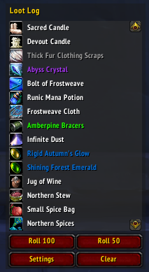
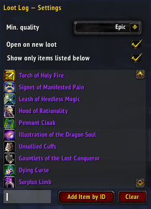

# Loot Log

Yet another loot tracker, this addon provides a simple method to track and filter loot in raids.

*Note: Loot is tracked by monitoring loot events near your character. If items are looted farther away, the addon might not capture it.*

To open the main window, you can type "/ll" or "/lootlog" in the chat, or use the minimap button.

## Basic functionality

The addon simply responds to loot events near your character. This means that everything you loot, or anybody in your group or raid loot near you, will be stored in a log window.

Tracked loot can reset by clicking on the "Clear" button. Roll buttons further allow you to roll /rnd 100 and /rnd 50 without a macro or typing chat commands.

## Settings

From the settings menu, you can filter items by selecting a minimum item quality, which defaults to epic loot.

In case you want to set up a list of items you need from you raid, you can add these items by their ID to a list. Further, you can set the main window to automatically open when new loot was tracked.